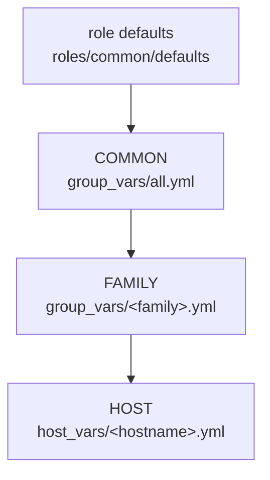

# petzko-dotfiles

Ansible configuration for my Linux machines. One shared baseline for **any**
Linux host, layered overrides per **distribution family** (Arch, Debian/Ubuntu,
RedHat/Fedora), and per-**host** deviations keyed on the machine's name.

## Layering model

Configuration is resolved in four layers, lowest precedence first. Higher layers
win for scalars; package lists *accumulate* through dedicated buckets.



| Layer  | File                                  | Scope                         |
|--------|---------------------------------------|-------------------------------|
| defaults | `roles/common/defaults/main.yml`    | safe baseline for everything  |
| common | `inventory/group_vars/all.yml`        | every host, every distro      |
| family | `inventory/group_vars/<family>.yml`   | one OS family                 |
| host   | `inventory/host_vars/<hostname>.yml`  | a single named machine        |

**Scalars** (`common_timezone`, `common_locale`, `common_manage_hostname`, ...)
are overridden by the highest layer that sets them.

**Package lists accumulate** — each layer fills its own bucket and the role
installs the concatenation (de-duplicated):

| Bucket                   | Set in                      |
|--------------------------|-----------------------------|
| `common_packages`        | role defaults (same name on every distro) |
| `__common_os_packages`   | `roles/common/vars/<OsFamily>.yml` (role-internal, per-family names) |
| `common_packages_all`    | `group_vars/all.yml`        |
| `common_packages_family` | `group_vars/<family>.yml`   |
| `common_packages_host`   | `host_vars/<hostname>.yml`  |

### Two complementary mechanisms

1. **Inventory groups** (`archlinux` / `debian` / `redhat`) drive the *user-facing*
   `group_vars/<family>.yml` layer. Put each host in its family group.
2. **Runtime facts** (`ansible_os_family`) drive the *role-internal* package-name
   abstraction in `roles/common/vars/<OsFamily>.yml`, loaded automatically — no
   manual wiring. CachyOS reports `os_family == Archlinux`, so it is handled by
   the Arch path with no special-casing.

## Layout

```
.
├── ansible.cfg                 # inventory path, fact cache, sane defaults
├── site.yml                    # playbook: common (all hosts) + additional_roles
├── requirements.yml            # Galaxy collections
├── bootstrap.sh                # install git/python/ansible on a fresh host
├── bin/dotfiles                # the self-locating dotfiles CLI (symlinked onto PATH)
├── Makefile                    # deps / syntax / lint / check / run helpers
├── inventory/
│   ├── hosts.yml               # hosts grouped by OS family
│   ├── group_vars/
│   │   ├── all.yml             # COMMON layer
│   │   ├── archlinux.yml       # FAMILY layer (Arch/CachyOS/...)
│   │   ├── debian.yml          # FAMILY layer (Debian/Ubuntu/...)
│   │   └── redhat.yml          # FAMILY layer (Fedora/RHEL/...)
│   └── host_vars/
│       └── petzko-lt-asus.yml  # HOST layer (this laptop)
└── roles/
    ├── common/                 # baseline applied to every host
    │   ├── defaults/main.yml
    │   ├── vars/{Archlinux,Debian,RedHat}.yml  # per-OS-family internals
    │   ├── tasks/{main,packages,system,flatpak}.yml
    │   └── meta/main.yml
    ├── bitwarden/              # pull SSH keys/notes/files (opt-in role)
    │   ├── defaults/main.yml
    │   ├── tasks/main.yml
    │   └── meta/main.yml
    ├── cli/                     # symlinks the dotfiles CLI onto PATH (opt-in role)
    ├── git/                     # symlinks a repo-tracked ~/.gitconfig (opt-in role)
    │   ├── files/gitconfig      # base .gitconfig, symlinked to ~/.gitconfig (git-tracked)
    │   ├── tasks/main.yml
    │   └── meta/main.yml
    └── zsh/                    # oh-my-zsh + symlinked ~/.zshrc (opt-in role)
        ├── files/zshrc         # base .zshrc, symlinked to ~/.zshrc (git-tracked)
        ├── defaults/main.yml
        ├── tasks/main.yml
        └── meta/main.yml
```

## Quick start

```bash
# Fresh machine: install prerequisites + collections
./bootstrap.sh

# Already have ansible? Just fetch collections:
make deps

# Validate before touching anything
make syntax
ansible-inventory --graph
ansible-inventory --host petzko-lt-asus   # see the merged variables

# Dry-run, then apply (prompts for sudo password)
make check LIMIT=petzko-lt-asus
make run   LIMIT=petzko-lt-asus
```

This laptop runs Ansible against itself (`ansible_connection: local` in the
inventory), so no SSH setup is needed locally.

## CLI — the `dotfiles` command

A single self-locating command wraps the common `ansible-playbook` invocations.
It is installed by `site.yml` via `additional_roles` (the `cli` role), which
**symlinks** `bin/dotfiles` to `~/.local/bin/dotfiles`. Because it is a symlink,
editing `bin/dotfiles` in the repo updates the live command (and stays
git-trackable). `~/.local/bin` is put on `PATH` by the `zsh` role.

| Command            | Does                                                    |
|--------------------|---------------------------------------------------------|
| `dotfiles sync`    | Apply `site.yml` to this host (the main command)        |
| `dotfiles check`   | Preview changes without applying (`--check --diff`)     |
| `dotfiles secrets` | Pull secrets from Bitwarden (`bitwarden` role only)     |
| `dotfiles update`  | Install/refresh Galaxy collections (`requirements.yml`) |
| `dotfiles add-host`| Add this machine to the inventory + a host_vars file    |
| `dotfiles commit`  | Secret-scan, then commit all changes (dated message)    |
| `dotfiles edit`    | Open the repo in `$EDITOR`                              |
| `dotfiles status`  | Show repo path, host and git working-tree status        |

Extra arguments pass straight through to `ansible-playbook`:

```bash
dotfiles sync --skip-tags bitwarden     # config only, skip secret-pulling
dotfiles sync --tags packages
dotfiles check --tags additional_roles
```

`dotfiles` prompts for the sudo password by default (Ansible escalates with
`sudo -n`, so a run with no password dies mid-play). Three environment
variables tune it, all optional:

- `DOTFILES_DIR` — repo path (resolved from the script's real path).
- `DOTFILES_HOST` — inventory host (defaults to `$(hostname)`).
- `DOTFILES_BECOME=none` — skip the sudo-password prompt, for NOPASSWD or
  headless/CI sudo (otherwise the prompt would hang an unattended run).
- `DOTFILES_FAMILY` — `archlinux`/`debian`/`redhat`; overrides `add-host`'s OS-family detection.

`dotfiles commit` stages everything, runs a secret scanner first when one is
installed (`gitleaks`, else `git-secrets`), then commits with a generic
`Update <date>` subject whose body is the `git status` changelog. The
comprehensive `.gitignore` keeps fact caches and secret material out of the repo.

## Adding things

**A new host** — add it under its family group in `inventory/hosts.yml`:

```yaml
debian:
  hosts:
    my-ubuntu-box:
      ansible_host: 192.0.2.10
      ansible_user: ubuntu
```

Then, only if it deviates, create `inventory/host_vars/my-ubuntu-box.yml`.

Or, on the new machine itself, run `dotfiles add-host`: it detects the OS family,
adds the inventory entry (with `ansible_connection: local`), and scaffolds
`inventory/host_vars/<hostname>.yml` with a starter `additional_roles` list.

**A new distribution family** — add `inventory/group_vars/<family>.yml`, a
matching `roles/common/vars/<OsFamily>.yml`, and a group in the inventory.

**Per-machine deviation** — set scalars or fill `common_packages_host` in
`inventory/host_vars/<hostname>.yml`. See `petzko-lt-asus.yml`, which overrides
the timezone, enforces the hostname, and adds laptop tooling.

## Secrets from Bitwarden

Pull SSH keys and files from your Bitwarden vault onto a host, via the
`bitwarden` role. It runs two ways:

- **In `site.yml`** for hosts that list `bitwarden` in `additional_roles` (this laptop does).
- **Standalone** via `dotfiles secrets` to (re-)pull on demand — runs only the `bitwarden` role, skipping the baseline.

**Security model.** Decrypting a vault needs one bootstrap secret. By default
**nothing is stored** — credentials are prompted at runtime (the role prompts
only when a value isn't already supplied):

- `client_id` / `client_secret` — only used to **log in**, and skipped entirely
  when the CLI is already authenticated (then only the master password is asked).
- The **master password** (hidden, never written to disk) unlocks the vault.
- Secret-handling tasks set `no_log: true`; private keys are written `0600`; the
  vault is re-locked when the run finishes.

**Setup.**

1. Get your personal API key: Bitwarden web vault → **Settings → Security →
   Keys → View API key** (re-enter master password). You get `client_id`
   (`user.…`, fixed) and `client_secret` (rotatable).
2. Declare what to fetch in `inventory/host_vars/<host>.yml`:
   `bitwarden_ssh_keys` (native SSH Key items → `~/.ssh/<name>` + `.pub`),
   `bitwarden_notes` (Secure Note body → a file, e.g. a SOPS age key), and
   `bitwarden_files` (item attachments → a file). Add `bitwarden` to the host's
   `additional_roles` to run it from `site.yml`.

**Run.**

```bash
dotfiles sync                          # all, incl. Bitwarden
dotfiles sync --skip-tags bitwarden    # config only, no prompts
dotfiles secrets                       # just (re-)pull secrets
# prompts: client_id, client_secret, master password
```

**Optional — skip prompts for unattended runs.** Any credential passed with
`-e` skips its prompt, so you can keep them in an ansible-vault file:

```bash
ansible-vault create creds.yml      # bitwarden_client_id / bitwarden_client_secret
dotfiles secrets -e @creds.yml --ask-vault-pass
# now only the master password is prompted (or vault it too for zero prompts)
```

For **headless/CI** use, swap to Bitwarden Secrets Manager: the
`community.general.bitwarden_secrets_manager` lookup authenticates with a machine
-account token (`BWS_ACCESS_TOKEN`) instead of a master password.

## Notes

- The `common` role manages packages (native + Flatpak), timezone, optional
  locale (Debian/Arch), optional hostname, and the login user's default shell
  (`common_user_shell`, default `/usr/bin/zsh`; toggle `common_manage_user_shell`).
  It is the seam to extend with dotfiles and desktop concerns — keep cross-distro
  names in `roles/common/vars/`.
- **Flatpak (fallback only)**: prefer the native package manager; use Flatpak
  only where an app isn't packaged for a distro. Discord is native `pacman` on
  Arch and a Flatpak on Debian/RedHat (declared per family). App entries are
  `{name, remote, state}` (`state` defaults to `present`; use `absent` to remove,
  as Arch does for the Flathub Discord). Extra remotes go in
  `common_flatpak_remotes(_host)`; disable per host with `common_manage_flatpak: false`.
- **Package-name divergence** is handled in `roles/common/vars/<OsFamily>.yml`
  (e.g. `fd`/`fd-find`, `base-devel`/`build-essential`/`@Development Tools`,
  `github-cli`/`gh`). On Debian the `gh` apt repo is added in `packages.yml`.
- **zsh role** (opt-in via `additional_roles`): clones oh-my-zsh to `~/.oh-my-zsh`
  and **symlinks** `~/.zshrc` → `roles/zsh/files/zshrc`. Editing that repo file
  (directly or through the symlink) changes your live `~/.zshrc`, so you can
  `git commit` to track shell config. A pre-existing real `~/.zshrc` is backed up
  to `~/.zshrc.pre-ansible` once. Machine-specific bits go in untracked
  `~/.zshrc.local`. (Assumes a local connection — the link targets this repo.)
- **git role** (opt-in via `additional_roles`): **symlinks** `~/.gitconfig` →
  `roles/git/files/gitconfig`. Editing that repo file (directly or through the
  symlink) changes your live `~/.gitconfig`, so you can `git commit` to track
  your Git config — set your `[user]` name/email there. A pre-existing real
  `~/.gitconfig` is backed up to `~/.gitconfig.pre-ansible` once. (Assumes a
  local connection — the link targets this repo.)
- Linting uses `yamllint` + `ansible-lint` (configs in `.yamllint` /
  `.ansible-lint`); install them to run `make lint`.
# dotfiles
# dotfiles
